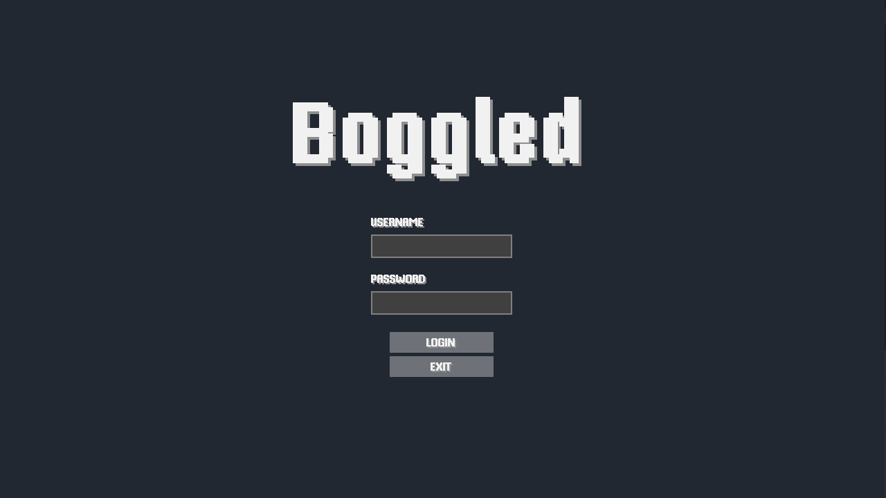
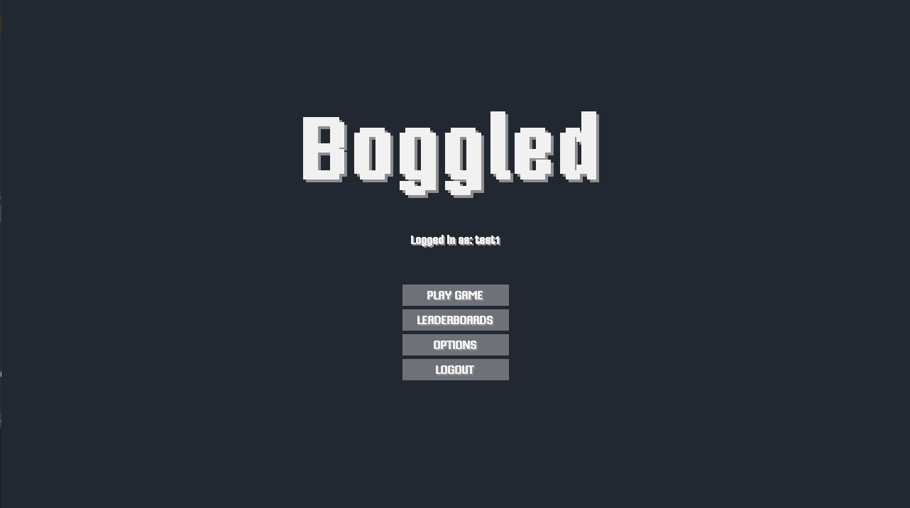
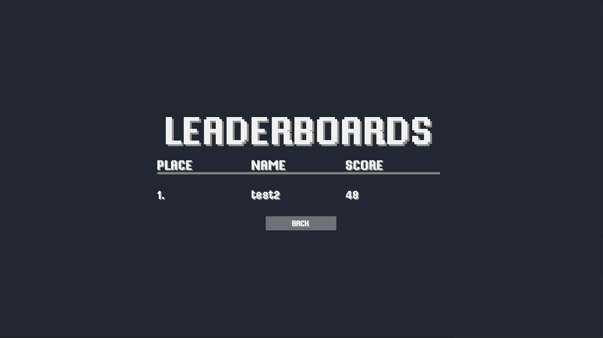
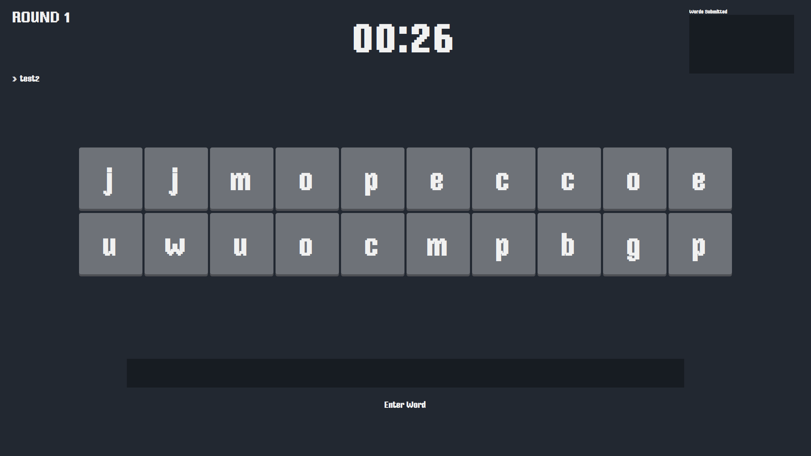
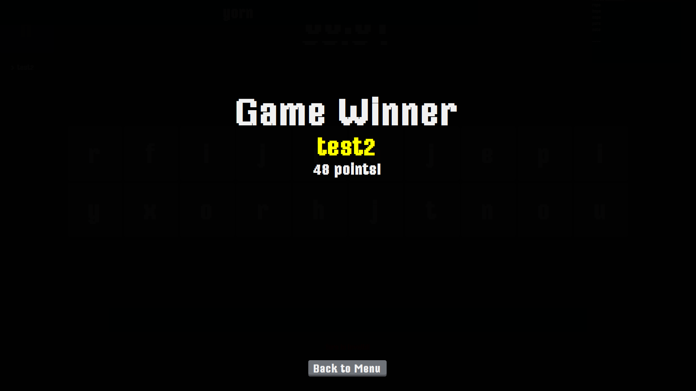
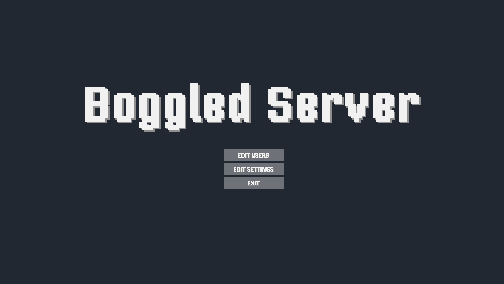
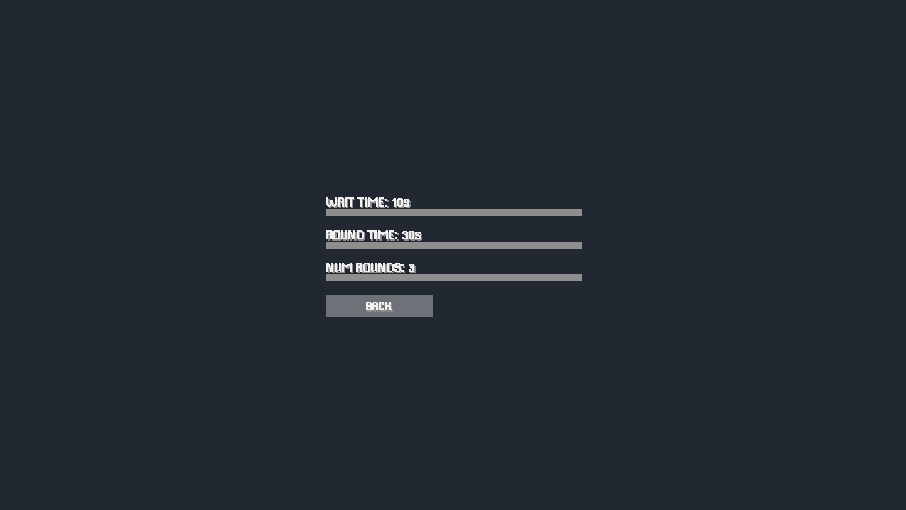

# Boggled - A Java CORBA Multiplayer Word Game


## About the Project
**Boggled** is a multiplayer word game built using Java CORBA. It allows multiple players to connect to a server, authenticate, and compete to form unique words from randomly generated letters. The game requires at least two players to start and runs until one player wins three rounds. An administrator has special privileges to manage players and game settings.


## Features

### Client Module
- **User Authentication**: Players must log in with valid credentials.
- **Game Interface**: Players receive 20 random letters (13 consonants, 7 vowels).
- **Word Submission**: Players can submit words of at least four letters.
- **Word Validation**: The client displays server responses indicating whether a word is valid or not.
- **Scoring System**: Players earn points for unique words.
- **Game Progression**: Displays round results and tracks player wins.
- **Leaderboard Display**: Players can view the **top scores** retrieved from the database.

### Server Module
- **Multiplayer Support via CORBA**: Handles multiple client connections.
- **Authentication Management**: Validates player credentials using a **MySQL database**.
- **Game Session Management**:
    - Ensures at least two players start a game.
    - Assigns random letters per session.
    - Maintains round timers and game flow.
- **Word Verification**: Cross-checks words against `words.txt` to determine validity.
- **Scoring System**: Calculates scores based on unique words.
- **Game Termination**: Ends the game when a player wins 3 rounds.
- **Administrator Privileges**:
    - Manage player accounts (CRUD operations).
    - Modify game settings (waiting time, round duration).
    - Retrieve leaderboard data for client display.
- **Persistent Storage**: Stores player data, scores, and game history in a **MySQL database**.


## Requirements
```markdown
- Java Development Kit (JDK) 8 or later
- MySQL Database
```


## Setup

### Clone the Repository
```markdown
git clone https://github.com/hanselijahv/boggled.git
cd boggled
```


## Running the Game

### Step 1: Start the ORBD (CORBA Naming Service)
Run the ORBD service to enable communication between the client and server.


### Step 2: Launch the Server
Start the game server to handle client connections and game logic.


### Step 3: Start the Client
Launch the client application to connect and participate in the game.


### Gameplay Flow:
- 🔑 **Login**: Players must authenticate before joining the game.
- 🎲 **Game Start**: A player initiates a session; the game begins if another player joins within the waiting time.
- 🔤 **Word Formation**: Players create words from randomly assigned letters.
- ✅ **Validation**: The server verifies submitted words using [`words.txt`](out/production/Server_Java/text/words.txt).
- 🏆 **Scoring**: Only unique valid words contribute to the player’s score.
- 📊 **Leaderboard**: Available on the **client-side**, displaying top scores.
- 🎯 **Winning Condition**: The game continues until a player **wins three rounds**.


## Program Snapshots
Below are snapshots of Boggled showcasing the Client and Server modules:

**Client Login Page**


**Client Home Page**


**Client Leaderboards Page**


**In-Game State**


**Winner Screen**


**Server Home Page**


**Changing Game Settings from the Server**



## Contributors
The following individuals contributed to the development of Boggled:

- **Matt Danielle Bravo**
- **[Neil Angelo Briones](https://www.linkedin.com/in/neil-briones/)**
- **Milton Junsel Fabe**
- **[Benny Gil Lactaotao](https://www.linkedin.com/in/benny-gil-9a0609238/)**
- **Dylan Yeoj Magpili**
- **Jermaine Bryan Pascual**
- **[Hans Elijah Viduya](https://www.linkedin.com/in/hanselijahv/)** 
