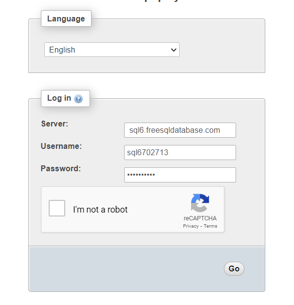

# Guide

*Delete this file before submitting project.*

## Online Database 

 Follow the steps in connecting to the online database.

1. Go to https://www.phpmyadmin.co/?fbclid=IwAR09IeHNrKGFjhZ3HjtC7jRWUrJIluKlsbT9U7j2Zp_CpcQiIgGO-mLK6ag

2. Enter server name, username, password
    
    

    * Servername:  sql6.freesqldatabase.com
    * Username: sql6702713
    * Password: WL6zwZjsKM

3. url to be used for connection
    
    * jdbc:mysql://sql6.freesqldatabase.com:3306/sql6702713
## Sound
**Location: "/sound/*.wav"**

### Adding sound files
- Make sure format is in .wav and 16 bit
- Use a converter (i.e., https://audio.online-convert.com/convert-to-wav)
